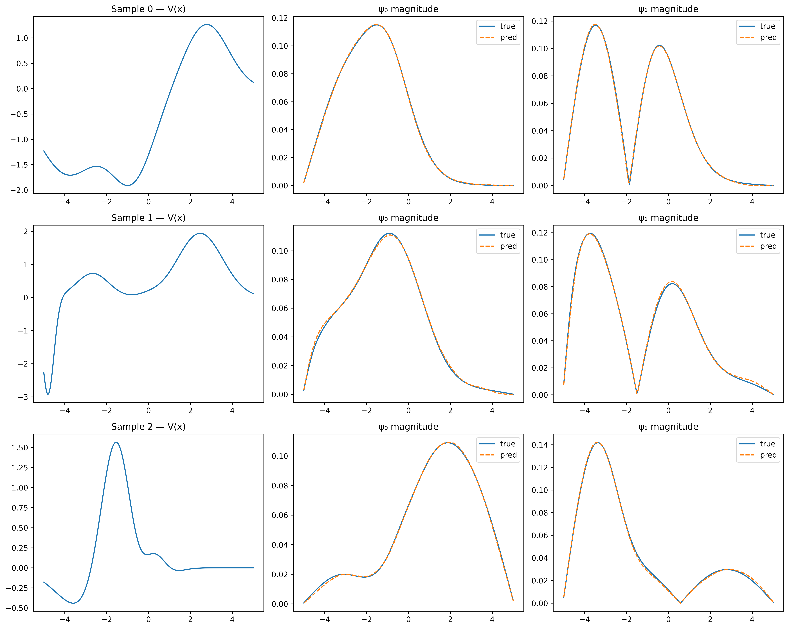
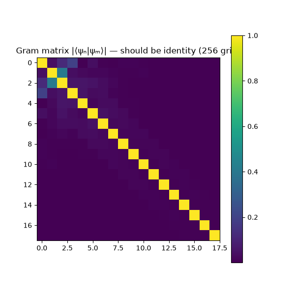

# Complex-Valued Neural Network (CVNN) Schrödinger Predictor

A high-performance physics-informed neural network designed to instantly predict the first $K=18$ eigenvalues and complex eigenfunctions of the 1D Time-Independent Schrödinger Equation for arbitrary potential structures.

## Objective
Solving the Schrödinger equation numerically (e.g., using diagonalization like `scipy.linalg.eigh_tridiagonal`) can be computationally intensive, scaling as $O(N^3)$ for dense matrices or requiring iterative solvers. The goal of this project is to train a custom **Complex-Valued Neural Network (PsiNet)** to map 1D potential profiles $V(x)$ directly to their corresponding eigenvalues and wavefunctions natively in complex space, enforcing physics symmetries (like arbitrary global phase and mutual orthogonality) and governing PDE constraints directly in the loss function.

## Results & Benchmark
After training on a generated dataset of **50,000 diverse Gaussian mixture potentials**, the model successfully generalized to unseen potential structures. 




### Performance (vs Scipy Traditional Solver)
Evaluated natively on an unseen validation set of 5,000 samples:
| Metric | Result |
| :--- | :--- |
| **Model Speed** | `0.97 ms` per sample |
| **Traditional Solver Speed** | `2.25 ms` per sample |
| **Speedup** | **2.31x Faster** 🚀 |
| **MAE (Eigenvalues)** | `0.0302` |
| **Relative Error (Eigenvalues)** | `~0.00%` |
| **MAE (Probability Density \|ψ\|²)** | `0.000058` |

The Neural Network operates **2.31x faster** than the optimized traditional numerical methods while returning highly accurate results with virtually zero relative error on the eigenvalue spectrum.

## Project Structure
- `dataset/` - Scripts and algorithms used for simulating and generating 50,000 ground-truth datasets. ([Read more](dataset/README.md))
- `models/` - CVNN model architecture definition and the physics-informed loss equations. ([Read more](models/README.md))
- `plots/` - Generated evaluation heatmaps and scatter graphs mapping true vs predicted values.
- `train.py` - Main training script utilizing JAX and Flax.
- `benchmark.py` - Evaluates the model against traditional SciPy eigensolvers.
- `plot_results.py` - Visualizes the test outputs.

## How to Run

1. **Setup Environment**:
   ```bash
   python -m venv venv
   source venv/bin/activate
   pip install jax jaxlib flax numpy scipy matplotlib
   ```

2. **Generate Dataset** (Generates 50k samples):
   ```bash
   python dataset/generate_data.py
   ```

3. **Train the Model**:
   ```bash
   python train.py
   ```
   *(Training logs and checkpoints are saved natively to the `logs/` directory)*

4. **Run the Benchmark**:
   ```bash
   python benchmark.py
   ```

5. **Generate Evaluation Plots**:
   ```bash
   python plot_results.py
   ```