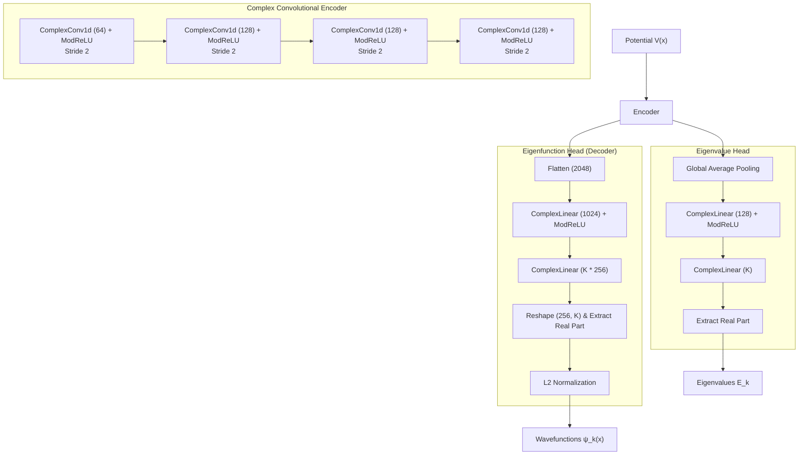

# CVNN Model Architecture & Losses

This directory contains the core model definitions and configurations for the Complex-Valued Neural Network (`PsiNet`) used to predict quantum mechanical eigenvalues and eigenfunctions.

## Model Architecture

The `PsiNet` architecture maps a 1D spatial potential $V(x)$ to $K=18$ predicted eigenvalues $E_k$ and their corresponding complex-valued eigenfunctions $\psi_k(x)$.



The network relies heavily on **Complex-Valued Convolutions** and **ModRelu** activations to capture the inherent complex symmetries of quantum mechanics:

1. **Complex Convolutional Encoder**
   - Maps $V(x)$ input into a complex-valued latent representation.
   - Applies repeated layers of `ComplexConv1d` mapping down spatially with `stride=2`.
   - Feature maps increment: $1 \rightarrow 64 \rightarrow 128 \rightarrow 128 \rightarrow 128$.
   - The non-linearity used is `ModRelu`.

2. **Eigenvalue Head**
   - Applies Global Average Pooling on the complex encoder output.
   - Passes through a `ComplexLinear` dense layer.
   - The final $K$ eigenvalues are extracted exclusively from the **real** component of the final linear projection.

3. **Eigenfunction Head (Decoder)**
   - Flattens the latent sequence into a high-dimensional vector.
   - Expands back into the full spatial grid $256 \times K$ using `ComplexLinear` layers.
   - Computes the $L_2$ norm and normalizes the complex predictions into physically valid wavefunctions.

## Loss Functions

The model is trained using a composite physics-informed loss function that enforces mathematical accuracy and physical constraints. Let $\hat{E}$ and $\hat{\psi}$ represent the model's predictions, and $E$ and $\psi$ represent the ground truth.

### 1. Eigenvalue Loss ($L_E$)
Measures the Mean Squared Error (MSE) of the predicted normalized energy eigenvalues:
```math
L_E = \frac{1}{K} \sum_{k=1}^K (E_k - \hat{E}_k)^2
```

### 2. Wavefunction Loss ($L_\psi$)
Measures the Mean Squared Error between the predicted and true wavefunctions. Because wavefunctions possess an arbitrary global $U(1)$ phase symmetry, we first align the phase of $\hat{\psi}$ with $\psi$:
```math
\text{phase} = \frac{\langle \psi | \hat{\psi} \rangle}{|\langle \psi | \hat{\psi} \rangle|}
```
```math
\hat{\psi}_{aligned} = \hat{\psi} \cdot \text{phase}^*
```
```math
L_\psi = \frac{\mathbb{E}[|\hat{\psi}_{aligned} - \psi|^2]}{\mathbb{E}[|\psi|^2]}
```

### 3. Orthogonality Loss ($L_{ortho}$)
Enforces the quantum mechanical requirement that stationary states are mutually orthogonal. Computes the Gram matrix $G_{ij} = \langle \hat{\psi}_i | \hat{\psi}_j \rangle$ and penalizes off-diagonal terms:
```math
L_{ortho} = \frac{1}{K(K-1)} \sum_{i \neq j} |G_{ij}|^2
```

### 4. Physics / PDE Residual Loss ($L_{phys}$)
Enforces the Schrödinger equation constraint natively using a finite-difference approximation of the Hamiltonian matrix $H$. The physics residual is calculated directly:
```math
\text{Residual} = H \hat{\psi} - \hat{E} \hat{\psi}
```
```math
L_{phys} = \mathbb{E}\left[\left| \frac{\text{Residual}}{|E_{mean}|} \right|^2\right]
```

### Total Objective
```math
\mathcal{L}_{total} = \lambda_1 L_E + \lambda_2 L_\psi + \lambda_3 L_{phys} + \lambda_4 L_{ortho}
```
